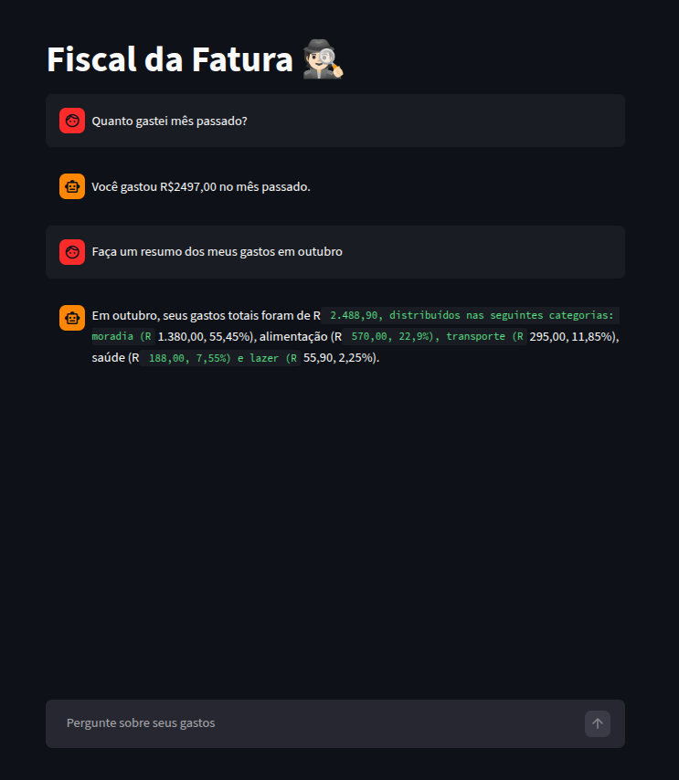

# Fiscal da Fatura 🕵🏻

O **Fiscal da Fatura** é um agente de Inteligência Artificial Generativa projetado para ajudar usuários a entenderem seus hábitos financeiros de forma natural e intuitiva. Em vez de planilhas complexas, o usuário simplesmente conversa com seus dados para obter insights sobre seus gastos.

Este projeto foi desenvolvido como parte do desafio **BIA do Futuro (DIO)**.

## 📺 Pitch do Projeto

Confira a apresentação completa e a demonstração da solução no vídeo abaixo:

👉 **[Assista ao Pitch no YouTube](https://www.youtube.com/watch?v=qot8jr5taSs)**

#

## 📸 Demonstração

Abaixo, um exemplo da interface do **Fiscal da Fatura** em ação, respondendo a perguntas sobre os gastos do usuário:




## 🚀 Funcionalidades

- **Análise de Transações:** Consulta gastos dos últimos 12 meses.
- **Categorização Automática:** Identifica quanto foi gasto em lazer, transporte, saúde, moradia, etc.
- **Resumos Dinâmicos:** Gera relatórios de períodos específicos com percentuais por categoria.
- **Interface Interativa:** Chat simples e direto via Streamlit.
- **Segurança de Dados:** O agente atua em modo "leitura", sem permissão para recomendações financeiras ou alteração de dados.

## 🛠️ Arquitetura Técnica

O sistema utiliza uma abordagem de **duas chamadas ao LLM** para garantir precisão e economia de tokens:

1.  **Geração de Query:** A primeira chamada converte a pergunta do usuário em um comando SQL compatível com **DuckDB**.
2.  **Execução:** O SQL filtra o arquivo `transacoes.csv`.
3.  **Interpretação:** A segunda chamada recebe os dados filtrados e gera uma resposta amigável e educativa.

## 📂 Estrutura do Repositório

```
📁 dio-lab-bia-do-futuro/
│
├── 📄 README.md
│
├── 📁 data/                          # Dados mockados para o agente
│   └── transacoes.csv                # Histórico de transações (CSV)
│
├── 📁 docs/                          # Documentação do projeto
│   ├── 01-documentacao-agente.md     # Caso de uso e arquitetura
│   ├── 02-base-conhecimento.md       # Estratégia de dados
│   ├── 03-prompts.md                 # Engenharia de prompts
│   ├── 04-metricas.md                # Avaliação e métricas
│   └── 05-pitch.md                   # Roteiro do pitch
│
├── 📁 src/                           # Código da aplicação
│   ├── README.md                    # Informações do script principal
│   └── app.py   
│      
└── 📁 assets/                        # Imagens e diagramas
    └── image.png                     # Screenshot da aplicação
```


## 🔧 Como Executar

1.  **Clone o repositório:**
    ```bash
    git clone https://github.com/CherylHenkels/dio-lab-bia-do-futuro.git
    ```
2.  **Instale as dependências:**
    ```bash
    pip install pandas duckdb streamlit openai
    ```
3.  **Configure sua API Key:** No arquivo `app.py`, insira sua chave da OpenAI.
    ```python
    os.environ['OPENAI_API_KEY'] = 'SUA_CHAVE_AQUI'
    ```
4.  **Rode a aplicação:**
    ```bash
    streamlit run src/app.py
    ```
#

## 📊 Métricas de Qualidade
O agente foi testado sob os critérios de:
- **Assertividade:** Respostas precisas baseadas em dados reais.
- **Segurança:** Bloqueio de alucinações e recusa de recomendações de investimento.
- **Coerência:** Tom de voz acessível e informal.

-----


## 📂 Link do Repositório

O código fonte completo e a documentação detalhada podem ser encontrados aqui:
🔗 **[Repositório GitHub](https://github.com/CherylHenkels/dio-lab-bia-do-futuro.git)**

-----
*Desenvolvido por Cheryl Henkels como um protótipo para transformar dados financeiros em decisões mais conscientes.*