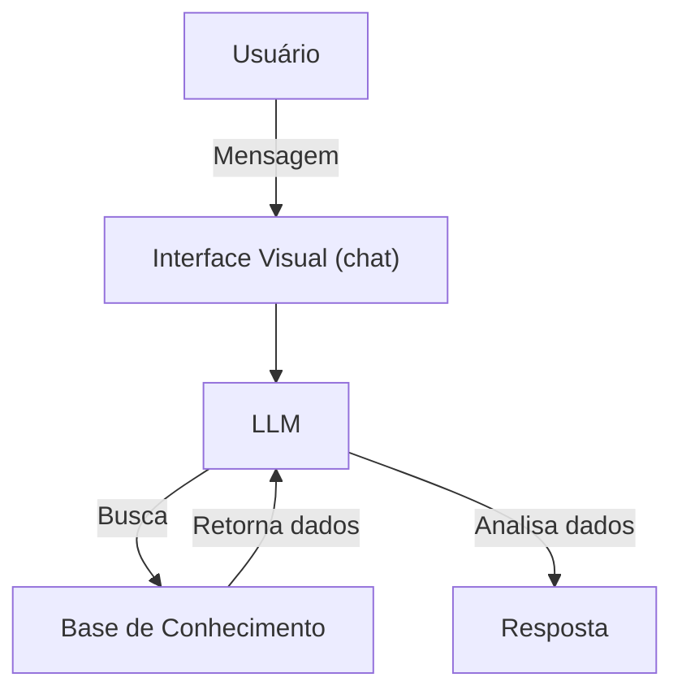

# Documentação do Agente

## Caso de Uso

### Problema
> Qual problema financeiro seu agente resolve?

Muitas pessoas têm dificuldade para controlar seus gastos, não sabendo exatamente para onde o dinheiro está indo. Essa falta de controle sobre as despesas pode levar a decisões financeiras ruins, como gastar mais do que se ganha.

### Solução
> Como o agente resolve esse problema de forma proativa?

O agente rastreia os gastos do usuário, classifica as despesas em categorias e identifica padrões de consumo. Além disso, ele gera insights e alertas que ajudam o usuário a compreender melhor seus hábitos financeiros, aumentando sua consciência sobre os gastos e apoiando decisões mais informadas.

### Público-Alvo
> Quem vai usar esse agente?

Pessoas que têm dificuldade para controlar, organizar e compreender seus gastos.

---

## Persona e Tom de Voz

### Nome do Agente
Fiscal da fatura 🕵🏻

### Personalidade
> Como o agente se comporta? (ex: consultivo, direto, educativo)

Consultivo

### Tom de Comunicação
> Formal, informal, técnico, acessível?

Acessível e informal

### Exemplos de Linguagem
- Saudação: [ex: "Oi! Eu sou o Fiscal da Fatura 🕵🏻. Vamos ver no que você andou gastando?"]
- Confirmação: [ex: "Entendi! Deixa eu analisar isso para você."]
- Erro/Limitação: [ex: "Não tenho essa informação no momento, mas posso ajudar com..."]

---

## Arquitetura

### Diagrama

### Componentes

`TODO: Definir os componentes`

| Componente | Descrição |
|------------|-----------|
| Interface | [Streamlit/ widgets] |
| LLM | [GPT-4 / Llama] |
| Base de Conhecimento | [JSON/CSV com dados do cliente] |
| Validação | [Checagem de alucinações] |

---

## Segurança e Anti-Alucinação

### Estratégias Adotadas

- [ ] [ex: Agente só responde com base nos dados fornecidos]
- [ ] [ex: Respostas incluem fonte da informação]
- [ ] [ex: Quando não sabe, admite e redireciona]
- [ ] [ex: Não faz recomendações de investimento]

### Limitações Declaradas
> O que o agente NÃO faz?

- Recomendações de gastos
- Recomendações de investimentos
- Não analisa carteira de investimentos
- Não realiza investimentos/compras
- Não toma decisões financeiras pelo usuário
- Não acessa automaticamente contas bancárias ou cartões
- Não atua como autoridade fiscal
